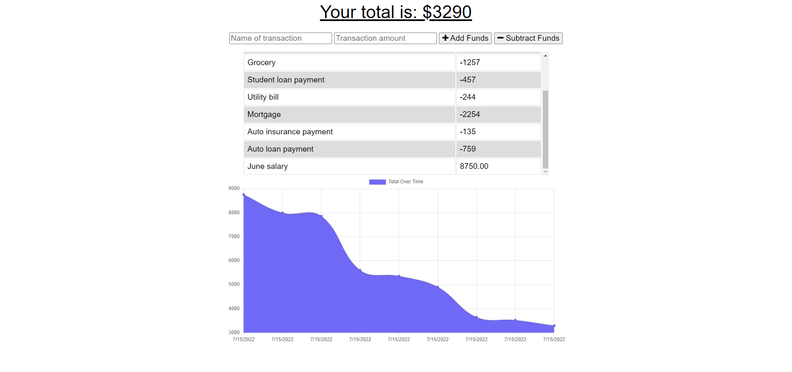

# Progressive Web Applications (PWA) Budget Tracker


## Table of Content

- [Description](#description)
- [Website Preview](#website-preview)
- [Installation and Deployment](#installation-and-deployment)
- [Source Code and Deployed App links](#source-code-and-deployed-app-links)
- [Usage](#usage)
- [Features](#features)
- [Sections](#sections)
- [Technologies](#technologies)
- [Dependencies](#dependencies)
- [Contributing](#contributing)
- [License](#license)
- [Questions](#questions)

## Description

This Budget Tracker is a progressive web application (PWA) that lets users track their budget by adding expenses and deposits via the "Add/Subtract Funds" button. Transactions can be added with or without a connection. Offline transactions are stored in the indexedDB and then transferred back to the database when the user comes back online.

## Website Preview



## Installation and Deployment

# 📦

## Installation

In order to use this application locally;

1. Simply git clone the repo to your local so that you have the Node project there on your local machine.
2. Use npm install to install the npm package dependencies listed in your package.json file.

## Deployment

1. Create a MongoDB Atlas account
2. Create production database in Atlas
3. Set up the environment variable in Heroku

```
heroku create
```

4. Connect production database to App
5. Once everything looks correct, we'll deploy the app to the Heroku accounts.

```
  git add -A
  git commit -m 'Deploying'
  deploy to heroku
  git push heroku main
```

## Source code and deployed app links

The app is also live at the following link:

- [live on Heroku](https://lit-mountain-19685.herokuapp.com/)

You can clone the most recent version of repo into your machine

- [Github](https://github.com/ghashe/progressive-web-applications-budget-tracker)

## Usage

To use the app locally, using the command line, you should run node server.js to start the application, and then open https://localhost:3001/ in any web browser to launch the app.

And then provide the following information for the transactions to be added as deposits or expenses:

- Name of transaction
- Transaction amoun
- And then select
  - **Add Funds** for deposits and
  - **Subtract Funds** for expenses
- In the graph, you can see the total funds over time by the date they were entered.

## Features

# 📋

⚡️ Accesible  
⚡️ Responsive  
⚡️ Efficient  
⚡️ Easy to use  
⚡️ Easy to modify

## Technologies

# 🛠️

    ✔️ HTML5
    ✔️ CSS
    ✔️ Bootstrap
    ✔️ jQuer
    ✔️ JavaScript ES6
    ✔️ Express
    ✔️ MongoDB
    ✔️ Mongoose
    ✔️ IndexedDB
    ✔️ Heroku (hosting platform)
    ✔️ MongoDB Atlas (a Heroku add-on for hosting the NoSQL database)

## Dependencies

    ✔️ compression: "^1.7.4",
    ✔️ express": "^4.17.1",
    ✔️ mongoose": "^5.5.15",
    ✔️ morgan": "^1.9.1"

## Contributing

# 💡

It would be great if you could contribute in any way

- 👯 Git clone the repo to your local machine
- 🔨🔨🔨 Develop your code
- 🔃 Create a new pull request.

## License

    MIT license has been applied to this project

## Questions

    If you have any questions, feel free to contact me via the following contact information:

- Email: emandaabyou@gmail.com
- GitHub account: [ghashe](https://github.com/ghashe)
- Linkedin: https://www.linkedin.com/in/abyou-geletu-5ba16622b

---

_This README has been generated by ❤ [Professional-README-generator](https://github.com/ghashe/professional-README-generator) © 2022_

---
